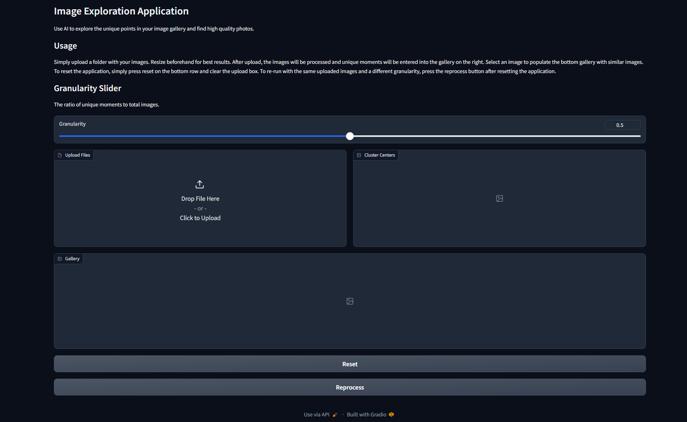
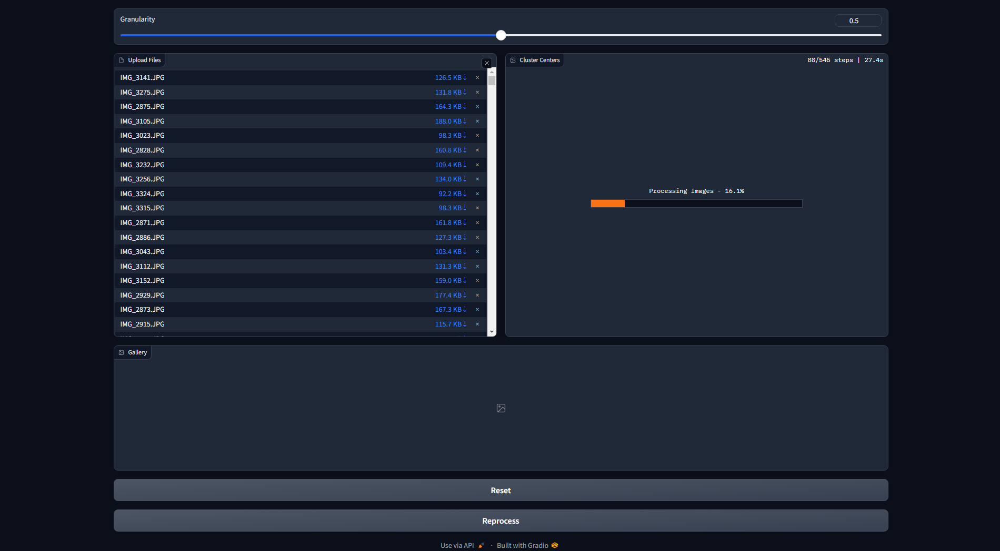
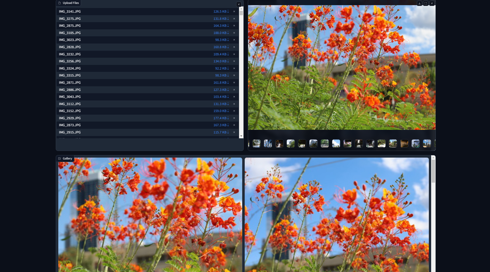

# Photo Sampler

An application to explore photos

## Usage

The Containerfile isn't working yet, but you can install the project in a new Python 3.11 virtual environment with:
```
pip install poetry
poetry install
```
Then you want to spin up the vector database with:
```
docker-compose up
```
followed by starting the main application:
```
python configs/config_local.json photo_sampler/demo.py
```

## Interface

The empty interface will look like this:


When images are processing, you'll see:


And then the UI will populate when an image is selected:


## Known Issues

Some of the timeouts in Gradio aren't finetuned. There might be a period of time after startup if you're using large images where you get some connection errors. Wait a minute and it should work fine, or fix the timeouts by adjusting them. 